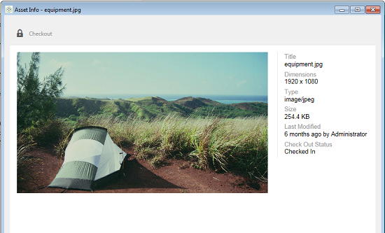
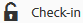

# Använd [!DNL Experience Manager]-datorprogrammet v1.10 {#use-aem-desktop-app-v1x}

Med appen är resurserna i [!DNL Experience Manager] enkelt tillgängliga på ditt lokala skrivbord och kan användas i alla skrivbordsprogram. Assets kan enkelt visas i Mac Finder eller Utforskaren i Windows, öppnas i skrivbordsprogram och ändras lokalt - ändringarna sparas i [!DNL Experience Manager] med en ny version som skapas i databasen.

Integreringen möjliggör centraliserad resurshantering och åtkomst mellan Creative Cloud och andra applikationer, vilket säkerställer överensstämmelse med branding och andra standarder.

De viktigaste uppgifterna du utför när du använder [!DNL Experience Manager]-datorprogrammet v1 är:

1. [Anslut till en [!DNL Experience Manager] server](#installandconnect)
1. [Öppna resurser direkt i datorprogrammet](#openondesktop)
1. [Redigera och checka ut resurser från datorprogrammet](#workonassets)
1. [Överför resurser och mappar i grupp](#bulkupload)

Information om de olika rekommenderade åtgärderna och inte finns i [metodtips för att använda skrivbordsappen](best-practices-for-v1.md). Om du har problem med appen kan du läsa om hur du [felsöker [!DNL Experience Manager] skrivbordsappen](troubleshoot-app-v1.md).

>[!NOTE]
>
>Skrivbordsappen introducerades i version [!DNL Experience Manager] 6.1 och kallades [!DNL Experience Manager Assets Companion App].

## [!DNL Experience Manager] kontaktytor i skrivbordsappen i det kreativa arbetsflödet {#aem-desktop-app-touch-points-in-the-creative-workflow}

Datorprogrammet [!DNL Experience Manager], tillsammans med [!DNL Assets], integreras i ditt kreativa arbetsflöde och erbjuder följande beröringspunkter.

![[!DNL Experience Manager]-skrivbordsappen pekar på det kreativa arbetsflödet](assets/aem_desktopapp_workflow.png)

[!DNL Experience Manager]-skrivbordsappen pekar på det kreativa arbetsflödet

## Installera och anslut appen till [!DNL Experience Manager]-servern {#installandconnect}

Innan du kan börja skapa eller redigera de kreativa resurserna måste du ansluta datorprogrammet till servern [!DNL Assets] för att hämta och överföra resurser i databasen. Utför följande uppgifter:

1. [Installera appen](#installapp).
1. [Ange dina inställningar](#inapppref) och anslutningsinformation.
1. [Anslut till en [!DNL Experience Manager] server](#connect) och montera resurskatalogen som lokal enhet.
1. [Aktivera skrivbordsåtgärder](#desktopactions) på servern [!DNL Experience Manager].

Skrivbordsappen [!DNL Experience Manager] använder en HTTPS-anslutning för att ansluta till servern [!DNL Experience Manager] för att överföra dina resurser på ett säkert och tillförlitligt sätt.

>[!NOTE]
>
>För alla eller delar av installations- och konfigurationsstegen kan du behöva hjälp av administratören eller systemadministratören för [!DNL Experience Manager].

### Installera programmet {#installapp}

Kontrollera att appen har stöd för din version av Experience Manager-servern för att kunna använda datorprogrammet Experience Manager. Hämta lämplig installationsfil (binär) för ditt operativsystem (Mac eller Windows) och installera programmet.

Det kan vara nödvändigt att göra en detaljerad konfiguration beroende på ditt nätverk och dina systeminställningar. Mer information finns i [Installera och konfigurera [!DNL Experience Manager] skrivbordsappen](install-configure-app-v1.md).

1. Gå till hämtningssidan för [[!DNL Experience Manager] datorprogrammet v1.10](/help/using/release-notes-of-v1.md) och hämta den binära filen för ditt operativsystem.
1. Starta den hämtade installationsfilen och följ instruktionerna på skärmen för att installera programmet.

   >[!NOTE]
   >
   >Endast en instans av [!DNL Experience Manager]-datorprogrammet kan installeras och vara aktiv åt gången.

### Förstå alternativen och inställningarna i appen {#inapppref}

Programmet tillåter inställningar för att ansluta och koppla från [!DNL Experience Manager] servrar, visa status för överföringar, hantera lokal cache och så vidare. Standardinställningarna fungerar för en typisk användare av programmet. Du kan ändra inställningarna för att få ut mer av programmet. Och få ut mer av integreringen med servern [!DNL Experience Manager]. Här följer de olika inställningarna:

**Utforska Assets** Öppna den lokala enheten där [!DNL Assets]-databasen är monterad. Du kan med andra ord utforska de resurser som nu finns tillgängliga på din lokala dator.

**Visa resursstatus** När ändrade resurser överförs eller nya resurser läggs till i [!DNL Assets] -databasen, överför programmet resurserna i bakgrunden. Bakgrundsuppladdningen möjliggör smidiga åtgärder utan att du behöver vänta tills överföringen är klar, särskilt för stora resurser. Du kan spara ändringarna lokalt och glömma det. Det tar ett tag att skicka resurserna till servern, beroende på den tillgängliga bandbredden. Du kan kontrollera överföringsstatus tillsammans med mer grundläggande information.

**Alternativ** Klicka på alternativen i skrivbordsappen för att ange att appen ska startas vid start, ansluta till [!DNL Experience Manager]-servern vid start och ändra den lokala enhetsbeteckningen för [!DNL Assets] efter montering.

**Avancerat > Hantera cacheminne** Du kan kontrollera mängden diskutrymme som är tillgängligt för lokal cachning. Artefakterna från servern [!DNL Assets] cachas lokalt för en smidigare upplevelse. Du kan ändra standardinställningarna så att de passar dina behov. Du kan även rensa cacheminnet för att hämta alla resurser på nytt. När du rensar cachen bevaras ändringarna som inte sparats. Alla resurser som inte har checkats in på servern [!DNL Experience Manager] behålls och tas inte bort.

### Anslut till en [!DNL Experience Manager]-server {#connect}

Appen stöder proxykonfiguration i Mac och Windows. Konfigurationen läses när appen startas. Om du ändrar proxyinställningarna startar du om programmet så att ändringarna börjar gälla.

>[!NOTE]
>
>Om du ändrar proxyinställningarna startar du om programmet så att ändringarna börjar gälla. Annars fortsätter programmet att använda den tidigare konfigurerade proxyservern.

1. Starta skrivbordsappen [!DNL Experience Manager]. Om du vill mappa din [!DNL Experience Manager]-instans med appen anger du [!DNL Experience Manager]-servern i formatet `https://[aem-server-url]:[port]`.

   ![Autentisera på Mac och ange [!DNL Experience Manager] server-URL ](assets/aem_desktop_app_server_url.png)

1. Ange användarnamn och lösenord för instansen på inloggningsskärmen. Om du vill ange en alternativ [!DNL Experience Manager]-instans markerar du alternativet **[!UICONTROL Alternate Login URL]**.

   ![Ange serverautentiseringsuppgifter för [!DNL Experience Manager] på inloggningsskärmen i [!DNL Experience Manager] skrivbordsappen](assets/login_screen_v1.png)

### Aktivera skrivbordsåtgärder i webbgränssnittet [!DNL Experience Manager] {#desktopactions}

I Assets användargränssnitt kan du utforska resursplatserna eller checka ut och öppna resursen för redigering i datorprogrammet. Dessa alternativ kallas skrivbordsåtgärder och är inte aktiverade som standard. Följ de här stegen för att aktivera den.

1. I Assets-gränssnittet klickar/trycker du på ikonen Användare i det övre högra hörnet av verktygsfältet.
1. Klicka på **[!UICONTROL My Preferences]** för att visa dialogrutan **[!UICONTROL Preferences]**.

   Gränssnittet ![[!DNL Experience Manager] med användarinställningarna ](assets/aem_ui_user_preferences.png)

1. I dialogrutan [!UICONTROL User Preferences] väljer du **[!UICONTROL Show Desktop Actions For Assets]** och klickar sedan på **[!UICONTROL Accept]**.

   ![Markera [!UICONTROL Show Desktop Actions For Assets] om du vill aktivera skrivbordsåtgärder](assets/enable_desktop_actions.png)

   *Bild: Markera [!UICONTROL Show Desktop Actions For Assets] för att aktivera skrivbordsåtgärder.*

## Få åtkomst till och öppna resurser på datorn {#openondesktop}

När du klickar på **Öppna** för att öppna en resurs på den lokala datorn hämtas resursen till dess interna cache. Programmet startar det inbyggda skrivbordsprogrammet som är associerat med filtypen för den hämtade resursen.

I Mac väljer du **Öppna** på snabbmenyn för att öppna en resurs via skrivbordsappen [!DNL Experience Manager]. I Windows väljer du Öppna på webben på snabbmenyn för att öppna resursen. Öppna resursen genom att klicka/trycka på ikonen  i fönstret Resursstatus.

För Adobe InDesign-filer (INDD) väljer du **[!UICONTROL Open]** på snabbmenyn. När du klickar på det här alternativet hämtar appen de länkade resurserna till ditt lokala filsystem och öppnar sedan INDD-filen i Adobe InDesign. Den här metoden ser till att nödvändiga resurser är lokalt tillgängliga när du redigerar INDD-filen.

![Alternativ på snabbmenyn för att komma åt och öppna resurser med [!DNL Experience Manager] skrivbordsappen ](assets/aem_desktopapp_mac_context_menu.png)

*Bild: Alternativ på snabbmenyn för att komma åt och öppna resurser med [!DNL Experience Manager]-datorprogrammet.*

>[!NOTE]
>
>Adobe rekommenderar att du går till Visningsalternativ i Finder på Mac och inaktiverar alternativen **Visa objektinformation**, **Visa förhandsgranskning av objekt** och **Visa förhandsgranskningskolumn** för den monterade [!DNL Assets]-mappen. Det förbättrar prestandan.

### Ytterligare alternativ i [!DNL Experience Manager]-gränssnittet {#additional-options-in-aem-assets}

När du har mappat databasen [!DNL Assets] till den lokala enheten kan du aktivera ytterligare ikoner och funktionen Mappöverföring visas för mappade resurser och mappar.

1. Öppna gränssnittet [!DNL Assets] och för pekaren över en mapp eller en resurs för att visa skrivbordsåtgärderna som snabbåtgärder i kortvyn.

   

   *Figur: I Assets-gränssnittet öppnar du snabbåtgärdsmenyn för att se skrivbordsåtgärder.*

   Dessa skrivbordsåtgärder är också tillgängliga när du klickar på alternativet **Skrivbordsåtgärder** i verktygsfältet efter att du har valt resursen eller från verktygsfältet på resurssidan.

1. Om du vill öppna resursen i skrivbordsprogrammet som är associerat med det specifika filtillägget klickar du på snabbåtgärden **Öppna på skrivbordet** .

   Du kan också välja **Öppna** på menyn **Skrivbordsåtgärder** i verktygsfältet.

Klicka på **Visa** snabbåtgärd  om du vill hitta en viss resurs i det lokala filsystemet. Du kan också välja **Visa** på menyn **Skrivbordsåtgärder** i verktygsfältet.

## Förstå tillgångsstatusarna {#understand-the-asset-statuses}

|  | Appen är ansluten till servern och alla resurser synkroniseras. |
--- |--- |
|  | Appen startas men är inte ansluten till servern. Vissa resurser kanske väntar på synkronisering. |
|  | Assets synkroniserar. Filerna överförs eller hämtas. Du kan se exakta statusvärden och pausa överföringar från fönstret Resursstatus. |
|  | Appen försöker återansluta. Nätverksproblemen kan leda till att anslutningen bryts. |

## Arbeta med dina resurser {#workonassets}

### Kolla in resurser från webbgränssnittet [!DNL Experience Manager] {#check-out-assets-from-the-aem-web-interface}

Med [!DNL Experience Manager Assets] kan du checka ut resurser för redigering och checka in dem igen när du har gjort ändringarna. När du har checkat ut en resurs kan bara du redigera, kommentera, publicera, flytta eller ta bort resursen. När du checkar ut en resurs låses resursen och andra användare hindras från att utföra någon av dessa åtgärder. Om du vill kunna checka ut/in resurser måste du ha skrivbehörighet för dem.

Det finns två sätt att checka ut resurser från webbgränssnittet [!DNL Experience Manager]. Mer information om den första metoden finns i [in- och utcheckningsfilerna från Assets-gränssnittet](https://experienceleague.adobe.com/sv/docs/experience-manager-65/content/assets/managing/check-out-and-submit-assets). Följ de här stegen för de andra metoderna för att checka ut och öppna resursen när [!DNL Experience Manager]-datorprogrammet är installerat.

1. Öppna gränssnittet [!DNL Assets] och för pekaren över en mapp eller en resurs för att visa skrivbordsåtgärderna som snabbåtgärder i kortvyn.

   

   Dessa skrivbordsåtgärder är också tillgängliga när du klickar/trycker på ikonen Skrivbordsåtgärder i verktygsfältet efter att du har valt resursen eller i verktygsfältet på resurssidan.

1. Om du vill öppna resursen klickar/trycker du på snabbåtgärden .

   Du kan också välja Öppna på menyn Skrivbordsåtgärder i verktygsfältet.

   >[!NOTE]
   >
   >När du redigerar en öppen men inte utcheckad fil vet andra användare inte att du uppdaterar resursen.

1. Om du vill öppna en resurs för redigering i ett Adobe Creative Cloud-program klickar du på ikonen  . Det här alternativet checkar också ut resursen för redigering. När du är klar med redigeringen checkar du in resursen för att uppdatera ändringarna i [!DNL Assets].

   Du kan också välja Redigera på menyn Skrivbordsåtgärder i verktygsfältet.

1. Välj menyalternativet Öppna. De valda resurserna öppnas i förhandsgranskningsläge.
1. Om du vill redigera resurserna väljer du alternativet Redigera. Resurserna öppnas i redigeringsläge.

### Ta en titt på resurser från Finder på macOS {#check-out-assets-on-mac}

Med appen kan du checka ut resursfiler för att förhindra att andra användare ändrar de filer som du arbetar med.

1. På snabbmenyn för Mac väljer du alternativet Öppna AEM Assets-mapp för att öppna Finder.

   ![Alternativ på snabbmenyn för att komma åt och öppna resurser med [!DNL Experience Manager] skrivbordsappen ](assets/aem_desktopapp_mac_context_menu.png)

   *Bild: Alternativ på snabbmenyn för att komma åt och öppna resurser med [!DNL Experience Manager]-datorprogrammet.*

1. Navigera till resursen som du vill checka ut.
1. Högerklicka på resursen och välj Mer Assets Info på snabbmenyn.
1. I dialogrutan Resursinformation klickar/trycker du på ikonen Checka ut för att checka ut resursen. Ikonen Checka ut växlar till ikonen för incheckning när du har klickat/tryckt på den.

   

1. Om du vill checka in resursen så att den är tillgänglig för andra användare klickar du på/trycker på incheckningsikonen i dialogrutan Resursinformation.

### Checka ut resurser i Windows {#check-out-assets-on-windows}

Med appen kan du checka ut resursfiler för att förhindra att andra användare ändrar de filer som du arbetar med.

1. På snabbmenyn väljer du Utforska Assets för att öppna Utforskaren.
1. I Utforskaren navigerar du till platsen för resursen som du vill checka ut.
1. Högerklicka på resursen och välj Öppna på webben på snabbmenyn.
1. Klicka på ikonen Checka ut i dialogrutan Resursinformation. Ikonen Checka ut växlar till ikonen för incheckning.

   

1. Granska resursen i Explorer. Låsikonen på resursen  anger att du har checkat ut resursen.

   >[!NOTE]
   >
   >Låsikonen kan visas efter en fördröjning. Skrivbordsappen [!DNL Experience Manager] cachelagrar resurserna för snabb åtkomst så det kan ta en stund att uppdatera den låsta statusen.

1. Om du vill checka in resursen så att den är tillgänglig för andra användare klickar/trycker du på ikonen för incheckning i dialogrutan **Resursinformation** .

### Checka in en resurs med Finder eller Utforskaren och med webbgränssnittet {#check-in-an-asset-using-finder-or-explorer-and-using-web-interface}

När du är klar med redigeringen av resurserna sparar du resurserna i skrivbordsprogrammet. Välj **Mer Assets Info** på snabbmenyn och klicka på Checka in.

Resurserna överförs till servern [!DNL Experience Manager]. Du kan också kontrollera överföringsstatus genom att välja **Visa resursstatus** från systemfältsikonen. Du kan också checka in en resurs från webbgränssnittet [!DNL Experience Manager]. Klicka på de utcheckade resurserna eller markera dem. Klicka på incheckningsikonen  i verktygsfältet.

En resurs överförs automatiskt till [!DNL Experience Manager] efter att ändringar har sparats lokalt. Incheckningen gör resursen tillgänglig för andra [!DNL Experience Manager]-användare för redigering.

### Överför resurser och mappar till servern [!DNL Experience Manager] gruppvis {#bulkupload}

Med skrivbordsappen [!DNL Experience Manager] kan du överföra en hel mapp som innehåller resurser från din lokala filkatalog till [!DNL Assets]. På så sätt överförs alla resurser i mappen gruppvis i stället för att behöva överföra dem en åt gången.

1. I Assets-gränssnittet klickar/trycker du på **Skapa** i verktygsfältet och väljer sedan **Överför mapp** på menyn.
1. Bläddra till mappen som du vill överföra och markera den.
1. Klicka/tryck på OK. I dialogrutan Assets Status visas status för överföringen.

   

   Se status för överföringen i fönstret Resursstatus

   >[!NOTE]
   >
   >Du kan pausa eller avbryta överföringen manuellt genom att klicka/trycka på lämplig ikon.

1. När mappen har överförts stänger du dialogrutan och navigerar till användargränssnittet i Assets. Den överförda mappen visas i webbgränssnittet.

Adobe rekommenderar inte att du kopierar och klistrar in eller drar ett större antal filer eller kapslade mappar från det lokala filsystemet till nätverksresursområdet. Programmet kan inte styra överföringsprocessen på grund av tekniska begränsningar och prestandan är dålig.

Du kan också markera filer/mappar i Finder eller Utforskaren, kopiera dem, navigera till målmappen i nätverksresursområdet och välja **Klistra in Assets** på snabbmenyn för [!DNL Experience Manager] skrivbordsappen. På så sätt börjar skrivbordsappen [!DNL Experience Manager] överföra de inklistrade resurserna som liknar alternativet **Överför mapp** som finns i webbgränssnittet [!DNL Experience Manager].

>[!MORELIKETHIS]
>
>* [Felsök [!DNL Experience Manager] skrivbordsprogram](troubleshoot-app-v1.md)
