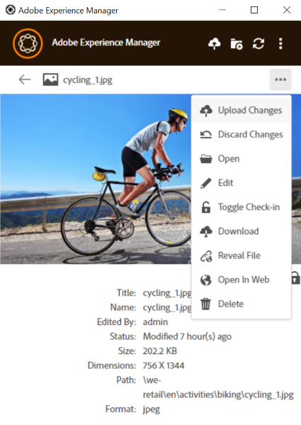
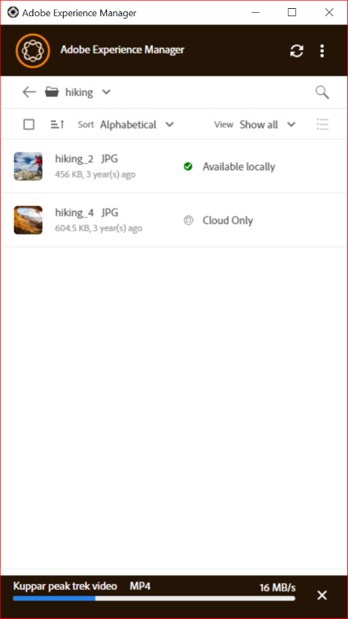
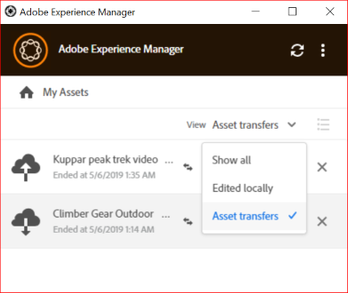

# Använd datorprogrammet [!DNL Adobe Experience Manager]  {#use-aem-desktop-app-v2}

Använd skrivbordsappen [!DNL Adobe Experience Manager] för att komma åt digitala resurser som lagras i en [!DNL Adobe Experience Manager] DAM-databas på din lokala dator. Du kan sedan använda dessa resurser i alla skrivbordsprogram. Du kan öppna och redigera resurserna lokalt i skrivbordsprogram. När du har gjort ändringar kan du överföra dem tillbaka till [!DNL Experience Manager] med versionskontroll för att dela uppdateringar med andra användare. Du kan också överföra nya filer och mapphierarkier till [!DNL Experience Manager], skapa mappar och ta bort resurser och mappar från [!DNL Experience Manager] DAM.

Integreringen gör att olika roller i organisationen kan hantera resurser centralt i [!DNL Experience Manager Assets] och få åtkomst till resurserna på det lokala skrivbordet i de ursprungliga programmen i Windows eller macOS.

När du öppnar programmet efter utloggning eller för första gången anger du URL-adressen till [!DNL Experience Manager]-servern i formatet `https://[aem-server-url]:[port]/`. Välj sedan alternativet [!UICONTROL Connect]. Ange autentiseringsuppgifter för att ansluta programmet till servern.

De huvuduppgifter du utför med skrivbordsappen [!DNL Adobe Experience Manager] är:

![Arbetsflöden och uppgifter du kan utföra med [!DNL Experience Manager] skrivbordsappen](assets/aem_desktop_app_usecases_v2.png "Arbetsflöden och uppgifter du kan utföra med  [!DNL Adobe Experience Manager] skrivbordsappen")

Hämta den [här](assets/aem_desktop_app_usecases_print.pdf) utskriftsklara PDF-filen.

## Så här fungerar skrivbordsappen {#how-app-works2}

Innan du börjar använda programmet bör du förstå [hur appen fungerar](release-notes.md#how-app-works). Bekanta dig också med följande termer:

* **[!UICONTROL Desktop Actions]**: Från Assets webbgränssnitt, från en webbläsare, kan du utforska resursplatserna eller checka ut och öppna resursen för redigering i ditt datorprogram. De här åtgärderna är tillgängliga från webbgränssnittet och använder skrivbordsappsfunktioner. Se [hur du aktiverar skrivbordsåtgärder](using.md#desktopactions-v2).

* Filstatusen är **[!UICONTROL Cloud Only]**: Sådana resurser hämtas inte på den lokala datorn och är endast tillgängliga på [!DNL Experience Manager]-servern.

* Filstatusen är **[!UICONTROL Available locally]**: Resurserna hämtas och är tillgängliga på den lokala datorn som de är. Resurserna ändras inte.

* Filstatusen är **[!UICONTROL Edited locally]**: Sådana resurser ändras lokalt och ändringarna finns kvar på den överförda servern [!DNL Experience Manager]. När du har överfört filen ändras statusen till [!UICONTROL Available locally]. Se [redigera resurser](using.md#edit-assets-upload-updated-assets).

* Filstatus är **[!UICONTROL Editing conflict]**: Om du och andra redigerar en resurs samtidigt anger programmet att en redigeringskonflikt har inträffat. Programmet innehåller även alternativ för att behålla eller ignorera ändringarna. Se [hur du undviker redigeringskonflikter](using.md#adv-workflow-collaborate-avoid-conflicts).

* Filstatus är **[!UICONTROL Modified remotely]**: Programmet anger om en resurs som du har hämtat ändras på servern [!DNL Experience Manager]. Programmet har också möjlighet att hämta den senaste versionen och uppdatera din lokala kopia. Se [hur du undviker redigeringskonflikter](using.md#adv-workflow-collaborate-avoid-conflicts).

* **[!UICONTROL Check-out]**: Om du redigerar en fil eller har för avsikt att redigera en fil, kan du växla status för att checka ut. Den lägger till en låsikon på resursen i appen och [!DNL Experience Manager]-webbgränssnittet. Låsikonen anger för andra användare att de inte behöver redigera samma resurs samtidigt eftersom den leder till en redigeringskonflikt.

* **[!UICONTROL Check-in]**: Markera resursen som säker så att andra användare kan redigera den utan att orsaka en redigeringskonflikt. När du överför dina ändringar tas låsikonen automatiskt bort. När du växlar incheckningsstatus tas även låsikonen bort, men Adobe rekommenderar att du undviker att checka in manuellt utan att överföra ändringarna. Om du ångrar ändringarna växlar du incheckningen manuellt.

* **[!UICONTROL Open]**-åtgärd: Öppna resursen och förhandsgranska den i det ursprungliga programmet. Adobe rekommenderar att du undviker att redigera resursen genom att använda den här åtgärden. Orsaken är att den inte checkar ut tillgången. Samtidigt kan andra användare göra redigeringar som leder till redigeringskonflikter.

* **[!UICONTROL Edit]**-åtgärd: Använd åtgärden för att ändra bilden. Om du klickar på [!UICONTROL Edit] checkas resursen ut och en låsikon läggs till på resursen. Om du inte vill redigera resursen klickar du på [!UICONTROL Toggle check-in] när du har klickat på Redigera. Om du vill ta bort, byta namn på eller flytta resurser i DAM-mapphierarkin [!DNL Experience Manager] använder du [!DNL Experience Manager]-webbgränssnittsåtgärderna och inte redigeringsåtgärden.

* **[!UICONTROL Download]**-åtgärd: Hämta resursen till din lokala dator. Du kan hämta resurserna nu och redigera dem senare. Arbeta offline och ladda upp ändringarna senare. Assets laddas ned i en cachemapp i filsystemet.

* **[!UICONTROL Reveal File]**- eller **[!UICONTROL Reveal Folder]**-åtgärd: När resurserna hämtas till en lokal cachemapp härmar programmet en lokal nätverksenhet. Den ger en lokal sökväg för varje resurs. Om du vill veta sökvägen använder du lämpligt visningsalternativ i appen. Funktionen Visa krävs för att placera resurser i Creative Cloud-programmet. Se [placera resurser](using.md#place-assets-in-native-documents).

* **[!UICONTROL Open In Web]**-åtgärd: Om du vill visa resursen i webbgränssnittet för [!DNL Experience Manager] öppnar du den på webben. Du kan initiera fler arbetsflöden från gränssnittet [!DNL Experience Manager], som att uppdatera metadata eller resursidentifiering.

* **[!UICONTROL Delete]**-åtgärd: Ta bort resursen från DAM-databasen [!DNL Experience Manager]. Åtgärden tar bort originalkopian av resursen på Experience Manager-servern. Om du bara vill ignorera ändringar i den lokala resursen läser du [Ignorera ändringar](using.md#edit-assets-upload-updated-assets).

* **[!UICONTROL Upload Changes]**: Skrivbordsappen överför bara den uppdaterade resursen när du uttryckligen överför den till servern [!DNL Experience Manager]. När du sparar redigeringarna sparas ändringarna bara på den lokala datorn. När du överför filen checkas resursen in automatiskt och låsikonen tas bort. Se [redigera resurser](using.md#edit-assets-upload-updated-assets).

## Aktivera skrivbordsåtgärder i webbgränssnittet [!DNL Experience Manager] {#desktopactions-v2}

I [!DNL Assets]-användargränssnittet i en webbläsare kan du utforska resursplatserna eller checka ut och öppna resursen för redigering i skrivbordsprogrammet. Dessa alternativ kallas [!UICONTROL Desktop Actions] och är inte aktiverade som standard. Följ de här stegen för att aktivera den.

1. Klicka på ikonen [!DNL Assets] i verktygsfältet i **[!UICONTROL User]**-konsolen.
1. Klicka på **[!UICONTROL My Preferences]** för att visa dialogrutan **[!UICONTROL Preferences]**.

1. I dialogrutan [!UICONTROL User Preferences] väljer du **[!UICONTROL Show Desktop Actions For Assets]** och klickar sedan på **[!UICONTROL Accept]**.

   

   *Figur: Välj [!UICONTROL Show Desktop Actions For Assets] om du vill aktivera skrivbordsåtgärder.*

## Bläddra bland, söka efter och förhandsgranska resurser {#browse-search-preview-assets}

Du kan bläddra till, söka efter och förhandsvisa de resurser som finns i [!DNL Experience Manager]-databasen, allt från skrivbordsprogrammet. Prova följande i appen:

1. Bläddra till en mapp och se grundläggande information om resurserna som finns i mappen, tillsammans med små miniatyrbilder av alla resurser.

   

1. Om du vill visa mer information och en större miniatyrbild av en enskild resurs klickar du på filnamnet.

   

1. Klicka på **[!UICONTROL Open]** eller **[!UICONTROL Edit]** om du vill hämta filen lokalt och bara visa eller redigera den i det ursprungliga programmet.
1. Sök med nyckelord för att hitta en relaterad resurs i databasen [!DNL Experience Manager]. Använd `?` och `*` som jokertecken. Dessa jokertecken ersätter ett enda tecken eller flera tecken. Filtrera och sortera resultatet efter behov.

   

   

>[!NOTE]
>
>Resurserna visas i programmet genom att sökvillkoren matchas i flera metadatafält, inte bara resursens namn eller filnamn.

## Hämta resurser {#download-assets}

Du kan hämta resurserna på det lokala filsystemet. Appen hämtar resurserna från servern [!DNL Experience Manager] och sparar samma kopia i det lokala filsystemet.

Klicka på ikonen  för alternativ och klicka på ikonen  för att hämta.

>[!NOTE]
>
>När du hämtar eller överför en stor fil eller många filer, inaktiveras åtgärderna för resurser och mappar. Åtgärderna är tillgängliga när hämtningen eller överföringen är klar.

Hämtning av flera resurser kan leda till sämre prestanda om köstorleken är stor eller om du har problem med nätverket. Du kan också ovetande köa många resurser för hämtning när du hämtar en mapp. För att undvika långa väntetider begränsar appen antalet resurser som hämtas på en gång. Mer information om hur du konfigurerar den finns i [Ange inställningar](install-upgrade.md#set-preferences). Även under denna gräns kan programmet ibland behöva be om en bekräftelse innan en till synes stor mapp laddas ned.

Om mappar markeras och hämtas hämtar programmet bara resurser som lagras direkt i mapparna i [!DNL Experience Manager]. Det hämtar inte resurser från undermappar automatiskt.

## Öppna resurser på datorn {#openondesktop-v2}

Du kan öppna fjärrresurserna för visning i det ursprungliga programmet. Resurserna hämtas till en lokal mapp. Sedan startas de i det program som är associerat med filformatet. Du kan ändra det inbyggda programmet så att det öppnar specifika filtyper (tillägg) i Mac eller Windows.

Klicka på **[!UICONTROL Open]** på resursmenyn. Resursen hämtas lokalt och öppnas i det ursprungliga programmet. Kontrollera hämtningsförloppet och överföringshastigheten för stora resurser i statusfältet.

<!-- 
-->

>[!NOTE]
>
>Om de förväntade ändringarna inte visas i appen klickar du på ikonen Uppdatera  eller högerklickar i appgränssnittet och klickar på **[!UICONTROL Refresh]**. Åtgärderna är inte tillgängliga medan större hämtningar eller överföringar pågår.

Om du vill öppna den lokala hämtningsmappen för en resurs klickar du på ikonen  och sedan på åtgärden  **[!UICONTROL Reveal File]** .

## Använd eller placera resurser i ursprungsdokument {#place-assets-in-native-documents}

I vissa fall, till exempel när du monterar en resurs i ett internt dokument, kan du få åtkomst till en fil i Utforskaren i Windows eller Mac Finder. Använd alternativet  **[!UICONTROL Reveal File]** om du vill gå till filsystemplatsen för den lokalt hämtade filen.

Klicka på **[!UICONTROL Reveal File]** eller **[!UICONTROL Reveal Folder]** i en mapp för att öppna Utforskaren eller Mac Finder med filen eller mappen förmarkerad på den lokala datorn. Alternativet är till exempel användbart om du vill montera [!DNL Experience Manager]-filerna i de ursprungliga programmen som har stöd för montering eller länkning av lokala filer. Mer information om hur du monterar filer i Adobe InDesign finns i [Montera bilder](https://helpx.adobe.com/indesign/using/placing-graphics.html).

Åtgärden **[!UICONTROL Reveal File]** öppnar en lokal nätverksresurs. Endast de resurser som är tillgängliga lokalt visas. Det innebär att resurser som har visats, hämtats eller öppnats/redigerats med appen visas. Den lokala nätverksresursen överför inga ändringar till [!DNL Experience Manager]. Använd **[!UICONTROL Upload Changes]**- eller **[!UICONTROL Upload]**-åtgärderna i appen explicit för att överföra ändringarna.

>[!NOTE]
>
>För bakåtkompatibilitet med [!DNL Experience Manager]-datorprogrammet v1.x hanteras de filer som visas från en lokal nätverksresurs, endast lokalt tillgängliga filer visas. Skrivbordssökvägarna för de visade filerna är samma som sökvägarna som skapas i programmet v1.x.

>[!CAUTION]
>
>Använd inte alternativet **[!UICONTROL Reveal File]** för att redigera resurser i inbyggda program. Använd i stället **[!UICONTROL Edit]**-åtgärderna. Mer information finns i [Avancerat arbetsflöde: samarbeta med samma filer och undvika redigeringskonflikter](#adv-workflow-collaborate-avoid-conflicts).

## Redigera resurser och överföra uppdaterade resurser till [!DNL Experience Manager] {#edit-assets-upload-updated-assets}

Öppna resurser för redigering när du vill göra ändringar och överföra de uppdaterade resurserna till servern [!DNL Experience Manager]. Om du vill undvika konflikter med redigeringar av andra användare använder du programmet för att starta en redigeringssession. Innan du börjar redigera bör du kontrollera att resursen inte har en låsikon som anger att en annan användare redigerar resursen.

Om du vill redigera en resurs söker du efter resursen eller bläddrar till resursens plats. Klicka på ikonen  och sedan på **[!UICONTROL Edit]**.

Använd **[!UICONTROL Toggle Check-out]** för att låsa resursen för att förhindra konflikter med redigeringar av andra användare i båda följande situationer:

* Du har börjat redigera en resurs utan att först checka ut den (till exempel genom att öppna den).
* Du har för avsikt att börja redigera en resurs inom kort och vill inte att andra ska kunna redigera den.

När du är klar med redigeringarna visas statusen **[!UICONTROL Edited Locally]** för de ändrade resurserna. Alla ändringar som har sparats i resurserna är bara lokala tills du överför ändringarna till [!DNL Experience Manager]. Om du vill överföra en enskild resurs eller ett fåtal resurser klickar du på **[!UICONTROL Upload Changes]** bland alternativen för en resurs. Den skapar en version av resursen i [!DNL Experience Manager]. Med webbgränssnittet för [!DNL Assets] kan du se resurshistorik i [tidslinjevyn](https://experienceleague.adobe.com/en/docs/experience-manager-65/content/assets/using/activity-stream).

Mer information om samarbetsbaserad redigering finns i [Avancerat arbetsflöde: Samarbeta med samma filer och undvik redigeringskonflikter](#adv-workflow-collaborate-avoid-conflicts).

I följande fall kanske du vill ignorera dina ändringar och redigeringar av den lokala resursen. Klicka på **[!UICONTROL Discard Changes]**.

* Om du inte vill spara ändringarna lokalt i [!DNL Experience Manager].
* Börja göra ändringar i den ursprungliga resursen när du har sparat några ändringar.
* Sluta redigera resursen eftersom den inte längre behövs.

Om det behövs kan du växla utcheckning. Den uppdaterade resursen tas bort från den lokala cachemappen och hämtas igen när du redigerar eller öppnar den.

## Överför och lägg till nya resurser till [!DNL Experience Manager] {#upload-and-add-new-assets-to-aem}

Användare kan lägga till nya resurser i DAM-databasen. Du kan till exempel vara fotograf eller entreprenör på en byrå som vill lägga till ett stort antal foton från en fotografering i [!DNL Experience Manager]-databasen. Om du vill lägga till nytt innehåll i [!DNL Experience Manager] väljer du  för överföring till molnet i appens övre fält. Bläddra till resursfilerna i det lokala filsystemet och klicka på **[!UICONTROL Select]**. Du kan också överföra resurser genom att dra filerna eller mapparna i programgränssnittet. I Windows överförs resurserna till mappen om du drar resurser till en mapp i appen. Om det tar längre tid att överföra visas en förloppsindikator.

<!-- 
-->

Du kan överföra mappar eller enskilda filer från det lokala filsystemet. En mapps hierarki bevaras när den överförs. Se [Massöverföring](#bulk-upload-assets) innan du överför resurser i grupp.

Klicka **[!UICONTROL View]** > **[!UICONTROL Assets transfers]** om du vill visa listan över resurser som överförts i en given session. I listan kan du visa och snabbt verifiera filöverföringar för den aktuella sessionen.

Du kan styra samtidighet för överföring (acceleration) i inställningen **[!UICONTROL Preferences]** > **[!UICONTROL Upload acceleration]**. Mer samtidighet ger vanligtvis snabbare överföringar, men kan vara resurskrävande och förbrukar mer processorkraft på den lokala datorn. Om du upplever ett långsamt system försöker du överföra igen med ett lägre värde av samtidighet.

>[!NOTE]
>
>Överföringslistan är inte beständig och är inte tillgänglig om du avslutar programmet och öppnar det igen.

### Hantera specialtecken i resursnamn {#special-characters-in-filename}

I det äldre programmet bevarade de nodnamn som skapades i databasen utrymmet och skiftläget för mappnamnen som användaren angett. Aktivera [!UICONTROL Use legacy conventions when creating nodes for assets and folders] i [!UICONTROL Preferences] om du vill att det aktuella programmet ska emulera reglerna för nodnamngivning i v1.10-appen. Se [appinställningar](/help/using/install-upgrade.md#set-preferences). Den här äldre inställningen är inaktiverad som standard.

>[!NOTE]
>
>Programmet ändrar bara nodnamnen i databasen med följande namnkonventioner. Appen behåller resursens `Title` som den är.

<!-- TBD: Do NOT use this table.

| Where do characters occur | Characters | Legacy preference | Renaming convention | Example |
|---|---|---|---|---|
| In file name extension | `.` | Enabled or disabled | Retained as is | NA |
| File or folder name | `. / : [ ] | *` | Enabled or disabled | Replaced with a `-` (hyphen) | `myimage.jpg` remains as is and `my.image.jpg` changes to `my-image.jpg`. |
| Folder name | `% ; # , + ? ^ { } "` | Disabled | Replaced with a `-` (hyphen) | tbd |
| File name | `% # ? { } &` | Disabled | Replaced with a `-` (hyphen) | tbd |
| File name | Whitespaces | Enabled or disabled | Retained as is | NA |
| Folder name | Whitespaces | Disabled | Replaced with a `-` (hyphen) | tbd |
| File name | Uppercase characters | Disabled | Retained as is | tbd |
| Folder name | Uppercase characters | Disabled | Replaced with a `-` (hyphen) | tbd |
-->

| Characters ‡ | Äldre inställning i appen | Vid förekomst i filnamn | Vid förekomst i mappnamn | Exempel |
|---|---|---|---|---|
| `. / : [ ] \| *` | Aktiverad eller inaktiverad | Ersatt med `-` (bindestreck). En `.` (punkt) i filnamnstillägget behålls som den är. | Ersatt med `-` (bindestreck). | `myimage.jpg` förblir oförändrad och `my.image.jpg` ändras till `my-image.jpg`. |
| `% ; # , + ? ^ { } "` och blanksteg |  inaktiverad | Blanksteg behålls | Ersatt med `-` (bindestreck). | `My Folder.` ändras till `my-folder-`. |
| `# % { } ? & .` |  inaktiverad | Ersatt med `-` (bindestreck). | NA. | `#My New File.` ändras till `-My New File-`. |
| Versaler |  inaktiverad | Läsningen behålls som den är. | Ändrad till gemener. | `My New Folder` ändras till `my-new-folder`. |
| Versaler |  aktiverad | Läsningen behålls som den är. | Läsningen behålls som den är. | NA. |

‡ Teckenlistan är en blankstegsavgränsad lista.

<!-- TBD: Check if the following is to be included in the footnote.

Do not use &#92;&#92; in the names of files and &#92;&#116; &#38; in the names of folders. 
-->

<!-- TBD: Securing the below presentation of the same content in a comment.

**File names**

| Characters | Replaced by |
|---|---|
| &#35; &#37; &#123; &#63; &#125; &#38; &#46; &#47; &#58; &#91; &#124; &#93; &#42; | hyphen (-) |
| whitespaces | whitespaces are retained |
| capital case | casing is retained |

>[!CAUTION]
>
>Avoid using &#92;&#92; in file names.

**Folder names**

| Characters | Replaced by |
|---|---|
| Characters | Replaced by |
| &#37; &#59; &#35; &#44; &#43; &#63; &#94; &#123; &#123; &#34; &#46; &#47; &#59; &#91; &#93; &#124; &#42; | hyphen (-) |
| whitespaces | hyphen (-) |
| capital case | lower case |

>[!CAUTION]
>
>Avoid using &#92;&#92; &#92;&#116; &#38; in folder names.

>[!NOTE]
>
>If you enable [!UICONTROL Use legacy conventions when creating nodes for assets and folders] in app [!UICONTROL Preferences], then the app emulates v1.10 app behavior when uploading folders. In v1.10, the node names created in the repository respect spaces and casing of the folder names provided by the user. For more information, see [app Preferences](/help/using/install-upgrade.md#set-preferences).

-->

## Arbeta med flera resurser {#work-with-multiple-assets}

Användare kan enkelt arbeta med och hantera flera resurser med åtgärder som att överföra alla redigeringar på en gång eller överföra kapslade mappar med några klick.

### Bläddra i stora mappar {#browse-large-folders}

När du arbetar med mappar som innehåller många resurser bläddrar du för att visa fler resurser. Om du vill rulla med tangentbordet trycker du på fliken några gånger för att markera resursen längst upp. Observera den markerade resursen för att veta när den är markerad. Använd nu nedåtpilen för att förflytta dig i resurslistan.

### Snabbåtgärder för valda resurser {#quick-actions-for-selected-assets}

Klicka på miniatyrbilden för några resurser för att markera resurserna. Om du vill markera alla resurser klickar du i kryssrutan i appens övre fält. Den uppsättning åtgärder som gäller för alla markerade resurser tillsammans visas i ett verktygsfält längst ned i programmet.

Vilka åtgärder som är tillgängliga i verktygsfältet längst ned beror på statusen för de valda filerna. Om du till exempel bara markerar **[!UICONTROL Edited Locally]** filer visas ikonen **[!UICONTROL Upload Changes]** . Om du väljer en blandning av **[!UICONTROL Edited locally]** och **[!UICONTROL Cloud only]** är åtgärden **[!UICONTROL Upload Changes]** inte tillgänglig.

### Söka efter alla redigerade bilder {#find-all-edited-images}

Programmet tillhandahåller en vy med namnet **[!UICONTROL Edited locally]** som ger dig snabb åtkomst till alla filer som du har hämtat lokalt (via [!UICONTROL Open] eller [!UICONTROL Edit] åtgärder) och sedan ändrat. Med appen kan du välja alla lokalt redigerade resurser och överföra ändringarna med några klick. I den här vyn visas även lokalt redigerade resurser som har en redigeringskonflikt.

### Överför resurser gruppvis {#bulk-upload-assets}

Användare eller organisationer, som fotografer och byråer, kan skapa olika resurser på plats under aktiviteter som fotografering, retuschering eller urval från en större uppsättning. Dessa åtgärder utförs ofta utanför [!DNL Experience Manager]. De kan överföra dessa stora lokala mappar till [!DNL Assets] direkt från skrivbordsappen. Mapphierarkierna bevaras och alla kapslade undermappar och inkluderade resurser överförs. De överförda resurserna är omedelbart tillgängliga för andra användare på samma server för användning. Assets överförs i bakgrunden, så åtgärden är inte kopplad till en webbläsarsession.

![Ladda upp flera lokala mappar från skrivbordet i [!DNL Experience Manager]](assets/upload_local_folders_da2.png "Ladda upp flera lokala mappar från skrivbordet till Experience Manager i grupp")

Om de förväntade ändringarna inte visas i appen klickar du på uppdateringsikonen  när du har överfört filen.

>[!NOTE]
>
>Använd inte överföringsfunktionalitet för att migrera resurser över två [!DNL Experience Manager]-distributioner. Se i stället [migreringsguiden](https://experienceleague.adobe.com/en/docs/experience-manager-65/content/assets/administer/assets-migration-guide).

### Lista över överförda tillgångar {#list-of-transferred-assets}

Mer information om hur du visar en lista över resurser som överförts under en viss session finns i [Överför resurser till [!DNL Experience Manager]](#upload-and-add-new-assets-to-aem).

## Avancerat arbetsflöde: starta från webbgränssnittet [!DNL Assets] {#adv-workflow-start-from-aem-ui}

Starta vid behov arbetsflödet från Assets webbgränssnitt. Skrivbordsappen integreras med [!DNL Experience Manager] för att ta över när det efterfrågas med skrivbordsåtgärder.

Ett särskilt exempel på hur du startar ett arbetsflöde från webbgränssnittet är resursidentifiering. Omnissearch bar i Assets användargränssnitt ger en omfattande och avancerad sökfunktion. Du kanske först vill hitta en önskad resurs på webben och sedan starta arbetsflödet i appen med hjälp av [!UICONTROL Desktop Actions]. I vissa exempelfall kan du filtrera sökresultat med hjälp av ansikten, hitta en specifik resurs som licensierats från Adobe Stock eller anpassa den som implementerats av din organisation så att du kan identifiera den bättre i webbgränssnittet.

Funktionen för skrivbordsprogram används när du försöker utföra följande åtgärder i Assets webbgränssnitt:

* [!UICONTROL Desktop Actions] som tillåter [!UICONTROL Open], [!UICONTROL Edit] och [!UICONTROL Reveal]
* [!UICONTROL Upload folder]
* [!UICONTROL Check-out] eller [!UICONTROL check-in]

De åtgärder på webbgränssnittet som är tillgängliga för en resurs som är utcheckad i appen är till exempel [!UICONTROL Open], [!UICONTROL Reveal] och [!UICONTROL Check in].

![Skrivbordsåtgärder i [!DNL Experience Manager] webbgränssnittet](assets/assets_web_actions_da2.png "Skrivbordsåtgärder i Experience Manager webbgränssnitt")

>[!NOTE]
>
>Webbläsaren kan uppmana dig att tillåta att skrivbordet [!DNL Adobe Experience Manager] startas. Om du vill att appen ska kunna överföras utan avbrott från webbläsaren till appen varje gång markerar du kryssrutan så att appen kan ta över.

Du kan inte hitta följande information eller arbetsflöde med webbgränssnittet. Använd skrivbordsappen eftersom webbgränssnittet inte kan spåra lokala ändringar och inte känner till följande:

* Filerna redigeras lokalt.
* Filer som har en redigeringskonflikt och ett sätt att lösa den.
* Överför lokala ändringar till [!DNL Experience Manager].
* Olika statusvärden för de lokalt tillgängliga filerna.

Du kan tvärtom öppna resursen i webbgränssnittet från skrivbordsappen med åtgärden **[!UICONTROL Open In Web]**.

## Avancerat arbetsflöde: samarbeta med samma filer och undvik redigeringskonflikter {#adv-workflow-collaborate-avoid-conflicts}

I samarbetsmiljöer kan flera användare arbeta med samma uppsättning resurser, vilket kan leda till versionskonflikter. Följ dessa metodtips för att förhindra konflikter:

* Redigera inga resurser genom att klicka på [!UICONTROL Open]. Redigera inte lokalt hämtade resurser genom att öppna dem från filsystemmappen. Andra användare vet inte om resursen redigeras.
* Om du vill redigera en resurs klickar du alltid på [!UICONTROL Edit]. Resursen öppnas i det ursprungliga programmet och en låsikon läggs till på resursen, så att de andra användarna vet att resursen redigeras.
* Klicka på [!UICONTROL Toggle Check-in] om du av misstag påbörjar redigering utan att klicka på [!UICONTROL Edit]. Den här funktionen lägger till en låsikon till resursen. Även om du planerar att redigera en resurs senare men vill undvika att andra redigerar den, klickar du på [!UICONTROL Toggle Check-in] för att låsa resursen.
* Innan du redigerar en resurs måste du se till att andra användare inte redigerar den. Leta efter låsikonen på resursen.
* När du är klar med redigeringarna överför du alla ändringar och checkar sedan in resursen.

Om en lokalt hämtad resurs uppdateras på servern [!DNL Experience Manager] visas programmets **[!UICONTROL Modified remotely]**-status. Du kan antingen ta bort din lokala kopia eller uppdatera den lokala kopian genom att klicka på [!UICONTROL Remove] respektive [!UICONTROL Update]. Med länkarna i dialogrutan kan du visa båda versionerna av resursen.

Om en resurs som du redigerar lokalt även uppdateras på servern utan din vetskap, visas statusen **[!UICONTROL Editing Conflict]** i appen. Du kan behålla en uppsättning av ändringarna - antingen behålla dina uppdateringar (klicka på **[!UICONTROL Keep Mine]**) och ta bort den andra användarens redigering eller ta hänsyn till den andra användarens uppdateringar och ta bort din (**[!UICONTROL Overwrite Mine]**).

## Avancerat arbetsflöde: placera och länka resurser i InDesign-filer {#adv-workflow-place-assets-indesign}

När du använder datorprogrammet [!DNL Experience Manager] för att öppna filer med länkade resurser hämtas resurserna i förväg och visas i de ursprungliga programmen. För att det här arbetsflödet ska fungera måste ditt inbyggda program ha stöd för att placera länkar till lokala resurser och [!DNL Experience Manager] måste ha stöd för att kunna matcha länkarna i de binära filerna med referenser på serversidan.

Skrivbordsappen [!DNL Experience Manager] har stöd för det här arbetsflödet med några utvalda Adobe Creative Cloud-program och -filformat - Adobe InDesign, Adobe Illustrator och Adobe Photoshop. Med arbetsflödet kan du arbeta effektivt med de Creative Cloud-filer som stöds. Om användare A lägger till resurser i en InDesign-fil och checkar in dem i [!DNL Experience Manager] kan användare B se resurserna i filen även om de inte är en del av den. Resurserna hämtas lokalt till dator med användare B.

>[!NOTE]
>
>Skrivbordsappen kan mappas till valfri enhet i Windows. För mjuka åtgärder ska du dock inte ändra standardenhetsbokstaven. Om användare i samma organisation använder olika enhetsbokstäver kan de inte se resurser som placerats av andra. De placerade resurserna hämtas inte när sökvägen ändras. De placerade resurserna fortsätter att vara placerade i den binära filen (till exempel INDD) och tas inte bort.

Mer information om begränsningarna i det här arbetsflödet finns i [systemkraven och versionerna som stöds](release-notes.md).

Så här provar du arbetsflödet med en bildresurs och InDesign:

1. Använd en INDD-fil med placerade resurser i [!DNL Experience Manager]. Mer information om hur du skapar en sådan INDD-fil finns i [Placera grafik](https://helpx.adobe.com/indesign/using/placing-graphics.html).
1. I skrivbordsappen **[!UICONTROL Edit]** den INDD-fil som innehåller placerade resurser i [!DNL Experience Manager].
1. Programmet hämtar InDesign-filen och de länkade resurserna. När InDesign öppnar dokumentet är länkarna lösta, resurserna hämtas och resurserna visas i InDesign-dokumentet.
1. Om du vill montera en ny bild i InDesign-filen använder du åtgärden **[!UICONTROL Reveal File]** för resursen. Åtgärden hämtar resursen lokalt och öppnar den lokala nätverksresursplatsen i Utforskaren eller Mac Finder.
1. Placera den visade resursen i InDesign-dokumentet. Då skapas en länk i dokumentet.
1. När du är klar med redigeringarna i InDesign-dokumentet sparar du det och överför det till [!DNL Experience Manager] med datorprogrammet.

## Avancerat arbetsflöde: hämta resurser lokalt {#adv-workflow-download-assets-locally}

Appen hämtar ofta resurser från servern [!DNL Experience Manager] till det lokala filsystemet. Nedladdningarna förbrukar bandbredd och diskutrymme. Genom att känna till scenarierna kan du optimera väntetiden för nedladdningen.

Du kan hämta resurserna inifrån programmet on-demand. Se [Hämta resurser](#download-assets).

När du använder åtgärden [!UICONTROL Open] för att öppna en resurs i ett systemspecifikt skrivbordsprogram hämtas resursen lokalt, om den inte redan är tillgänglig lokalt. Se [Öppna resurser](#openondesktop-v2).

När du visar platsen för en resurs eller en mapp inifrån programmet hämtas resursen eller mappen först lokalt och öppnas sedan på datorn i den lokala nätverksresursen. Se [Öppna resurser](#openondesktop-v2).

När du använder åtgärden [!UICONTROL Edit] för att redigera en resurs i ett systemspecifikt skrivbordsprogram hämtas resursen lokalt, om den inte redan är tillgänglig lokalt. Se [Redigera resurser och överföra uppdaterade resurser till [!DNL Experience Manager]](#edit-assets-upload-updated-assets).

Om programmet är installerat och tillåts att göra det, slutförs åtgärderna när du använder [!UICONTROL Desktop Actions] från [!DNL Experience Manager]-webbgränssnittet. Programmet hämtar resursen först och slutför sedan åtgärden.
